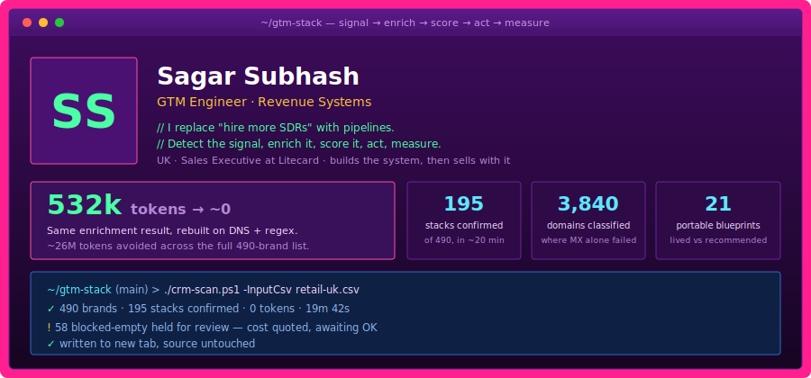

## What I do

I build revenue systems instead of adding headcount to them.

Every play runs the same loop: **signal → enrich → score → route → act → measure → kill or freeze.** The discipline is in the last two steps. Most teams build signals and never close the measurement loop, so nothing gets killed and nothing gets templated.

---

## Things I'm proud of

**I killed a 26 million token bill with a DNS lookup.**
Needed the CRM and email platform for 490 retail brands. The obvious build was AI agents plus a scraping API: 53k tokens per brand, and a ten-brand pilot burned 532k proving it. Then I looked at what the agents were doing — fetching a page and matching strings against vendor names. A regex does not need a language model. Rebuilt on SPF and DKIM records plus a homepage regex: same answers, 195 platforms confirmed, about 20 minutes, effectively zero tokens. → **[crm-scan](https://github.com/suhmantics-droid/crm-scan)**

**I got past the bot wall without paying to go around it.**
46% of a 1,015-domain list sat behind Cloudflare and returned 403. Instead of buying a rendering service, I found signals that survive: Shopify answers on `/products.json` even when the homepage refuses, and store locators live in `sitemap.xml`, which is served to crawlers by design. Recovered physical-presence data for 1,483 domains at no added cost.

**I read the mail host correctly after MX lied.**
Security gateways mask the real mailbox provider, so MX alone left 336 domains as a useless "Other". Classifying from SPF includes, the autodiscover CNAME and DKIM selectors resolved them into 3,022 Microsoft and 818 Google — reusing DNS text already fetched, for free. Matters because Microsoft-heavy lists are materially harder to land cold email in.

**A 75% bounce rate became the rule that prevents it.**
A 180-row pass on pattern-guessed emails came back 75% NXDOMAIN. The fix was not a better guessing heuristic, it was a hard rule: no guessed data ever reaches a system of record. Unknown stays blank and flagged. Every rule I operate by has a scar like this behind it.

---

## How I work

| | |
|---|---|
| **No guessed data** | Verified or blank. Never a plausible-looking placeholder. |
| **Free path first** | Exhaust free and verified sources before anything metered. |
| **Spend needs a yes** | Show the count and the cost, then wait for it. |
| **Never overwrite the source** | New output, always. The original list is sacred. |
| **Drafts, not sends** | A human sends outreach. Every time. |
| **Signal-based or it isn't a play** | Spraying a list is not engineering. |

---

## Selected work

**[crm-scan](https://github.com/suhmantics-droid/crm-scan)** — Detect a brand's email platform, loyalty stack and mail host from DNS and one page fetch. No keys, no vendor, no LLM. `PowerShell`

**baskit** — Wishlist app that answers "should I actually buy this?" Scores every saved item on price history, cool-off and budget. Documented decision engine, 57 unit tests, Playwright suite, self-serve GDPR deletion. `TypeScript · Next.js · Prisma · Postgres`

**gtm-stack** — Discovery to delivery: audit a business, map its available signals and data maturity, return plays ranked by impact × ease, then freeze the winners into one-command skills. 21 portable blueprints, each labelled lived or recommended. `PowerShell · Python`

---

## Stack

`PowerShell` `Python` `TypeScript` `Next.js` `Prisma` `Postgres` `DNS/SPF forensics` `Companies House API` `Google Sheets API` `Shopify` `Vitest` `Playwright`

---

Every figure above comes from a run log, not an estimate. Where something is untested, it says so.
