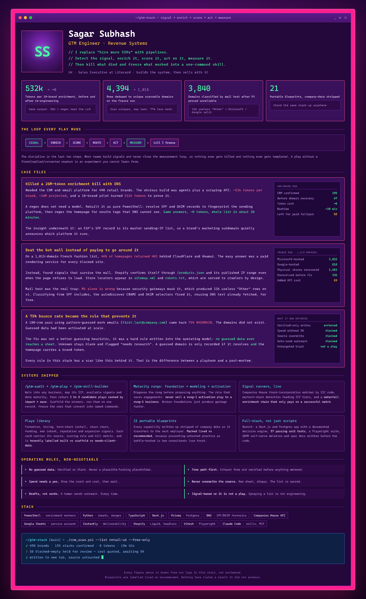

### Selected work

- **[crm-scan](https://github.com/suhmantics-droid/crm-scan)** — Detect a brand's email platform, loyalty stack and mail host from DNS and one page fetch. No keys, no vendor, no LLM. `PowerShell`
- **baskit** — Wishlist app that scores every saved item on price history, cool-off and budget. Documented decision engine, 57 unit tests, Playwright suite, self-serve GDPR deletion. `TypeScript · Next.js · Prisma · Postgres`
- **gtm-stack** — Audit a business, map its signals and data maturity, return plays ranked by impact × ease, then freeze the winners into one-command skills. 21 portable blueprints. `PowerShell · Python`

Every figure in the card comes from a run log, not an estimate. Where something is untested, it says so.
